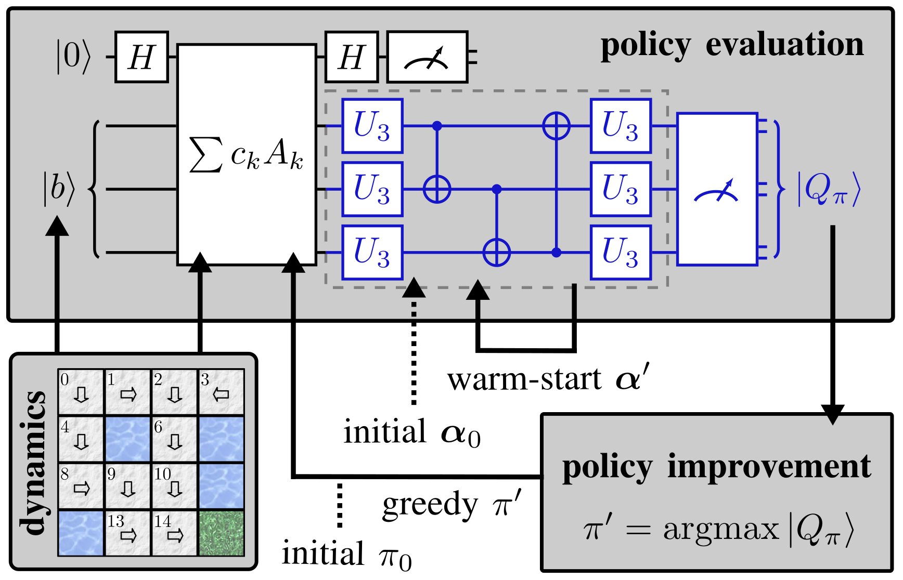

# Warm-Start Variational Quantum Policy Iteration

[
](https://arxiv.org/abs/2404.10546)

This repo contains the code for the paper 
["Warm-Start Variational Quantum Policy Iteration", N. Meyer et al., arXiv:2404.10546 (2024)](https://arxiv.org/abs/2404.10546).



> Reinforcement learning is a powerful framework
aiming to determine optimal behavior in highly complex decision-making
> scenarios. This objective can be achieved using policy iteration, which requires to solve a typically large linear system of
equations. We propose the **variational quantum policy iteration
(VarQPI) algorithm**, realizing this step with a **NISQ-compatible
quantum-enhanced subroutine**. Its scalability is supported by an
analysis of the structure of generic reinforcement learning 
> environments, **laying the foundation for potential quantum 
> advantage** with utility-scale quantum computers. Furthermore, we 
> introduce the **warm-start initialization variant (WS-VarQPI)** that
**significantly reduces resource overhead**. The algorithm solves a
large FrozenLake environment with an underlying 
> 256×256-dimensional linear system, indicating its practical robustness.

## Setup and Installation

The library requires an installation of `python 3.12`, and following libraries:
- `variational-lse-solver~=1.0`

We recommend setting up a conda environment and install the required packages:

```
conda create --name ENV_NAME python=3.12
conda activate ENV_NAME
cd ws-varqpi
pip install -r requirements.txt
```

## Usage and Reproduction of Results

Details on how to use the implementation and adjust hyperparamters are described in the documentation.
We also provide an implementation of the generic RL environment used for the analysis in the appendix of the paper in `environments_lse/generic_lse.py`

Variational Quantum Policy Iteration (VarQPI) can be performed on the FrozenLake environment by running
```
python examples/main.py
```

Warm-Start Variational Quantum Policy Iteration (WS-VarQPI) can be performed on the FrozenLake environment by running
```
python examples/main.py --warm_start
```

To guarantee reproducible results, one can set the `--seed` argument.

<details>
    <summary><b>Results of VarQPI with --seed=42</b></summary><br/>

        Initial policy:
        |>|^|<|>|
        |>|x|<|x|
        |>|v|>|x|
        |x|>|^|o|
        Epoch 1/1:   8%|▊         | 837/10000 [01:24<15:23,  9.92it/s, best loss=0.000106, last improvement in step=813, loss=0.0001]
        Loss of 0.0000998134 below stopping threshold.
        Returning solution.
        Policy after iteration 1:
        |>|^|<|v|
        |v|x|v|x|
        |>|v|v|x|
        |x|>|>|o|
        Epoch 1/1:  13%|█▎        | 1318/10000 [02:10<14:16, 10.14it/s, best loss=0.000109, last improvement in step=1313, loss=0.000115]
        Loss of 0.0000980673 below stopping threshold.
        Returning solution.
        Policy after iteration 2:
        |v|>|v|<|
        |v|x|v|x|
        |>|v|v|x|
        |x|>|>|o|
        Epoch 1/1:  13%|█▎        | 1310/10000 [02:08<14:12, 10.20it/s, best loss=0.00011, last improvement in step=1303, loss=0.0001]
        Loss of 0.0000997932 below stopping threshold.
        Returning solution.
        Final policy:
        |v|>|v|<|
        |v|x|v|x|
        |>|v|v|x|
        |x|>|>|o|
        TERMINATED after 3 iterations
        
</details>

<details>
    <summary><b>Results of WS-VarQPI with --seed=42</b></summary><br/>
    
        Initial policy:
        |>|^|<|>|
        |>|x|<|x|
        |>|v|>|x|
        |x|>|^|o|
        Epoch 1/1:   8%|▊         | 837/10000 [01:22<15:00, 10.17it/s, best loss=0.000106, last improvement in step=813, loss=0.0001]
        Loss of 0.0000998134 below stopping threshold.
        Returning solution.
        Policy after iteration 1:
        |>|^|<|v|
        |v|x|v|x|
        |>|v|v|x|
        |x|>|>|o|
        Epoch 1/1:  12%|█▏        | 1200/10000 [01:56<14:17, 10.26it/s, best loss=0.000126, last improvement in step=1155, loss=0.00013]
        Loss of 0.0000946993 below stopping threshold.
        Returning solution.
        Policy after iteration 2:
        |v|>|v|<|
        |v|x|v|x|
        |>|v|v|x|
        |x|>|>|o|
        Epoch 1/1:   6%|▌         | 616/10000 [00:59<15:12, 10.29it/s, best loss=0.000116, last improvement in step=517, loss=0.000109]
        Loss of 0.0000996890 below stopping threshold.
        Returning solution.
        Final policy:
        |v|>|v|<|
        |v|x|v|x|
        |>|v|v|x|
        |x|>|>|o|
        TERMINATED after 3 iterations

</details>

## Citation

If you use this implementation or results from the paper, please cite our work as

```
@article{meyer2024warm,
  title={Warm-Start Variational Quantum Policy Iteration},
  author={Meyer, Nico and Murauer, Jakob and Popov, Alexander and Ufrecht, Christian and Plinge, Axel and Mutschler, Christopher and Scherer, Daniel D.},
  journal={arXiv:2404.10546},
  year={2024},
  doi={10.48550/arXiv.2404.10546}
}
```

## License

Apache 2.0 License
  